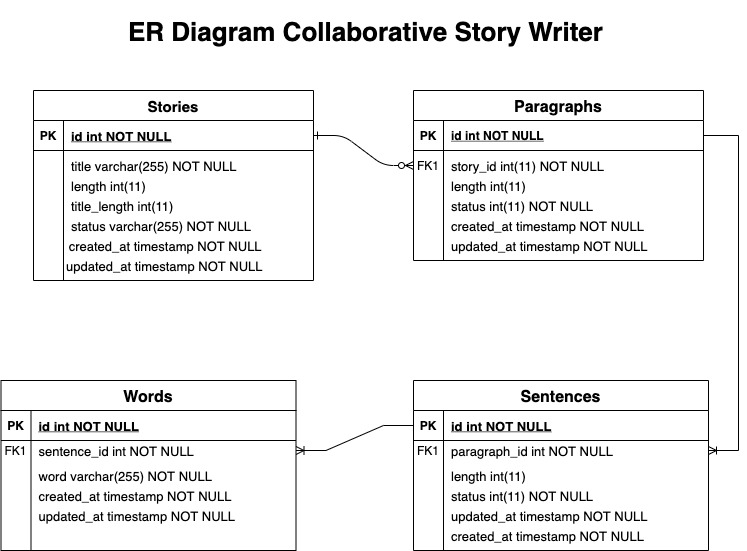

# Verloop Collaborative Story Writer
Details - https://drive.google.com/file/d/1SF2rsgeiatEkrPZIxZsqf2n8EzuDGxH-/view

## Description
This project is used to do collborative story writing, where multiple users can call /add word API from their interface. And they can fetch different stories by using /stories API. 

This project is built using clean architecture principles where multiple routes and handlers are written under "web" package. This package is responsible for parsing request body, url params and basic validations. Then flow is transferred to "manager" package which contains core business logic of particular API. Then it interacts with "usecase" under "model" package which is superficial to database layer, it is wrapper where we can handle multiple databases like mysql, elasticsearch etc depending on different databases, our application is using. Currently in this project it might not seems to be useful. After this, flow goes to different particular databases, like "db/mysql" package in this project, where actually required query is executed.

When application is started, then all database connections objects are initialized and stored. Also configurations are loaded at app start only for which "common" package is used. These configurations are written in different files under "files" package. For managing constants, "constant" package is used. And for using any helper functions, "lib" package is created.


## Prerequisites for Development
1. Go - 1.16
2. Mysql - 5.6

## ER Diagram


## How to run your code?
1. Setup mysql database by replacing <password> with root password in below command.
```
mysql -u root -p<password> < "./files/sql/db.sql"
```
2. Install golang 1.16 using https://golang.org/dl/.
3. Setup GOPATH by using below command. Referenced from this - https://golang.org/doc/gopath_code
```
export GOPATH=$HOME/go
export PATH=$PATH:$GOROOT/bin:$GOPATH/bin
```
4. Download and clone this repository to *$GOPATH/src/* folder.
5. Run application as below. If debug logs have to enabled, set VERLOOP_DEBUG environment variable with any value, else it will be disabled.
```
VERLOOP_DEBUG=true go run app.go
```

## Assumptions
* It is assummed that user requires latest response everytime.
* Database is setup in localhost, if it is set in other host, then configuration needs to be changed in story_writer.main.ini.

## If you had more time, what would you do differently?
* Write unit test cases and functional test cases.
* Using SQL transactions in add word API and rolling back if anything fails.
* Sending proper error codes and status in case of failures.
* Adding more logs.
* Use hashicorp/consul to dynamically manage configurations from its dashboard. This will help in modifying configuration on the fly without any deployment.
* Profile code using jaegar/opentracing.
* Improve business logic in add word API by distributing code into more granular methods.
* Use Redis for caching stories response to save multiple db calls for same story or it can be done by caching response at API Gateway layer also by using Nginx. It will also help in scaling our application.
* Use Docker for containerization.
* Use MessageQueue for add word API to process add word asynchronously, as everytime it will interact with Database, so DB server CPU usage will go high and can be single point of failure. So we need to process add word in some batches.
* Use NoSql database would be better option here, as it is easier to scale horizontally NoSql database. It depends on functional requirement, if stale response is fine.